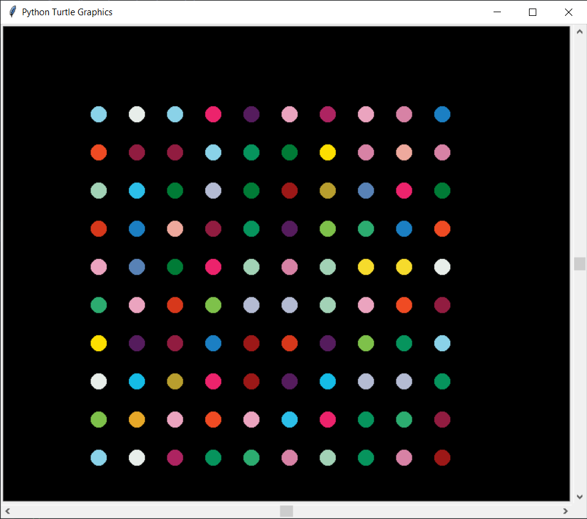

### The output of my code.

### The top colorgram.py code in main.py is commented out because I only ran it once to be able to grab a color pallet sample from the image.jpg file.

    import colorgram

    colors = colorgram.extract('image.jpg', 30)
    color_list = []

    for i in colors:
    r = i.rgb.r
    g = i.rgb.g
    b = i.rgb.b
    color_list.append((r, g, b)) 

    print(color_list)

This is the output of `colorlist[ ]`

    color_list = [(236, 35, 108), (145, 28, 64), (239, 75, 35), (6, 148, 93), (232, 238, 234), (231, 168, 40), (184, 158, 46), (44, 191, 233), (27, 127, 195), (126, 193, 74), (253, 223, 0), (85, 28, 93), (173, 36, 97), (246, 219, 44), (44, 172, 112), (215, 130, 165), (215, 56, 27), (235, 164, 191), (156, 24, 23), (21, 188, 230), (238, 169, 157), (162, 210, 182), (138, 210, 232), (0, 123, 54), (88, 130, 182), (180, 187, 211)]

The image I colorsampled using the [colorgram.py module](https://pypi.org/project/colorgram.py/) and the code above.
